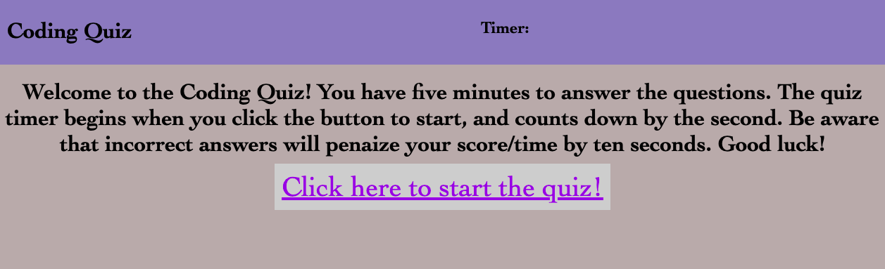
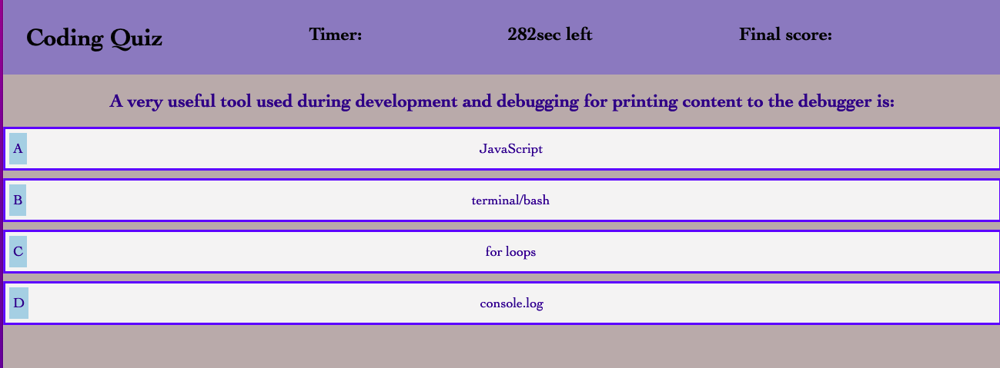
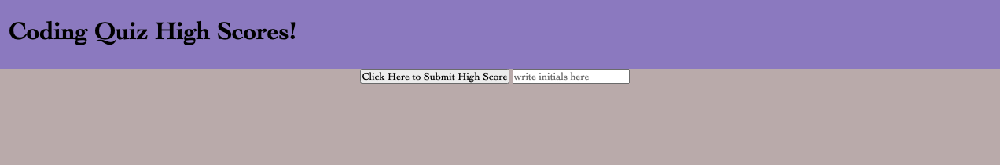

# Challenge Four: Coding Quiz

## For this challenge, I attempted to create a timed coding quiz. My attempt was unsuccessful and this coding quiz is, in fact, not amazing despite the page title. I do plan to return to this project and improve upon it. For now, the code was mostly created by following James Q Quick's video tutorials step by step on YouTube. Those tutorial videos can be found here: https://www.youtube.com/playlist?list=PLDlWc9AfQBfZIkdVaOQXi1tizJeNJipEx. 

### This link will take you to the deployed application:

[See deployed site here](https://kristynerhaugen.github.io/amazing-code-quiz/)

## Installation
### Access the code via GitHub. Install how you would usually install from a GitHub repository. 

## Usage
### This application is to be used to take a four question quiz. 

### These images show the deployed site:
#### 
#### 
#### 

## Credits 
### I used what I learned in the BootCamp Spot modules and BootCamp classes to create this quiz. I also heavily relied on following the instructions in James Q Quick's YouTube video tutorials. These videos can be found at https://www.youtube.com/playlist?list=PLDlWc9AfQBfZIkdVaOQXi1tizJeNJipEx. I used this website to learn about a countdown timer: https://www.w3schools.com/howto/howto_js_countdown.asp. I used this site to try to understand .map in javaScript: https://www.w3schools.com/jsref/jsref_map.asp#:~:text=map()%20creates%20a%20new,not%20change%20the%20original%20array. When I was trying to hide elements, I used these two sites for guidance: https://javascript.plainenglish.io/how-to-apply-css-styles-to-page-elements-using-javascript-e6d4a22a40de and https://careerkarma.com/blog/css-hide-element/. 

## License